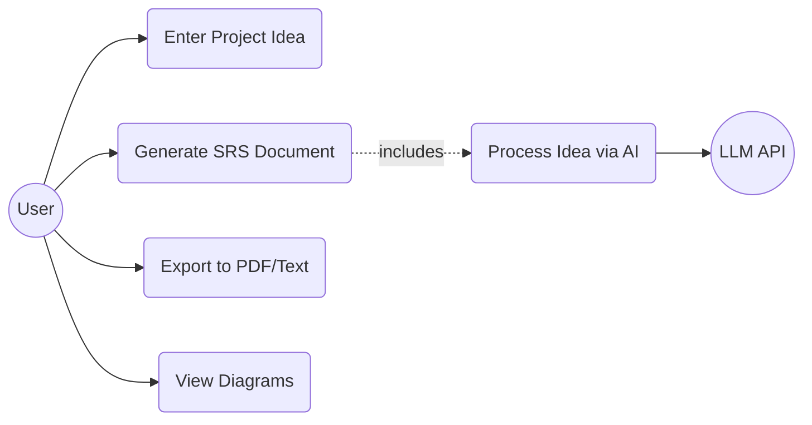
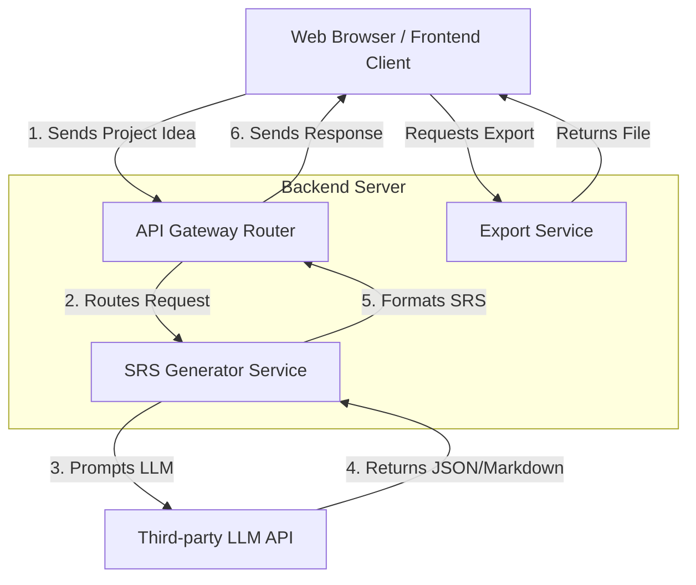

# Software Requirements Specification (SRS)
**Project Title:** AI-Powered SRS Generator
**Target Audience:** Academic Submission / Industry Use

---

## PHASE 2: BASIC PERSONA CREATION

### Persona 1: The Student
* **Name:** Alex Carter
* **Role:** University Student (Computer Science)
* **Goal:** Create a professional and properly formatted SRS for a final-year Capstone project quickly.
* **Problem faced:** Struggles to understand the exact structure required by academic standards and often misses edge cases when brainstorming system requirements manually.

### Persona 2: The Non-Technical Founder
* **Name:** Sarah Jenkins
* **Role:** Startup Founder 
* **Goal:** Quickly draft standard requirements to hand over to a freelance developer to build an MVP.
* **Problem faced:** Doesn't know technical jargon and wants a system that can translate a plain English product idea into structured technical requirements.

### Persona 3: The Beginner Developer
* **Name:** David Lin
* **Role:** Junior Developer
* **Goal:** Generate standard documentation for a side project to practice proper software engineering workflows.
* **Problem faced:** Finds writing documentation tedious and prefers to use automated tools to scaffold the paperwork so he can focus on writing code.

---

## PHASE 3: SRS GENERATION

### 1. Introduction
* **Purpose:** The purpose of this document is to define the requirements for the AI-Powered SRS Generator, a web application designed to automatically generate structured, professional SRS documents from simple user input.
* **Scope:** The system will take a natural language description of a software idea as input and output a complete SRS document, including generated user personas and basic architectural diagrams in Mermaid.js format. The system will allow users to export the result to PDF or plain text.
* **Overview:** This document covers the overall description, system features, external interfaces, non-functional requirements, and the high-level system architecture of the SRS Generator.

### 2. Overall Description
* **Product perspective:** The SRS Generator is a standalone web application featuring a frontend user interface and a backend service integrated with a Large Language Model (LLM) to process inputs.
* **User classes:** University Students, Beginner Developers, and Startup Founders.
* **Operating environment:** The system operates as a responsive web application and is accessible via any modern web browser safely connected to the internet.

### 3. System Features

#### Feature 1: Natural Language Idea Processing
* **Description:** The system accepts a plain-text description of a project idea and prepares it for AI processing.
* **Simple Use Case:**
  * **Actor:** User
  * **Action:** Enters "I want to build a platform that generates SRS documents automatically."
  * **Result:** System processes the text and initiates generation.

#### Feature 2: Automated SRS Document Generation
* **Description:** The system generates a structured SRS document (Introduction, Features, NFRs, etc.) based on the processed idea.
* **Simple Use Case:** 
  * **Actor:** User
  * **Action:** Clicks the "Generate SRS" button.
  * **Result:** System displays a complete, structured SRS document on the screen.

#### Feature 3: Automated Persona Generation
* **Description:** The system generates 2-3 realistic user personas relevant to the inputted project idea.
* **Simple Use Case:**
  * **Actor:** User
  * **Action:** Navigates to the "Personas" section.
  * **Result:** System displays generated names, roles, goals, and problems of target users.

#### Feature 4: Diagram Generation (Mermaid.js)
* **Description:** The system generates a Use Case Diagram and a basic System Architecture Diagram using Mermaid.js syntax.
* **Simple Use Case:**
  * **Actor:** User
  * **Action:** Navigates to the "Diagrams" section.
  * **Result:** System renders the visual diagrams from the generated Mermaid code.

#### Feature 5: Document Export
* **Description:** The system allows the user to download the generated outputs.
* **Simple Use Case:**
  * **Actor:** User
  * **Action:** Clicks "Export as PDF" or "Export as Text".
  * **Result:** A file containing the generated SRS is downloaded to the user's local device.

### 4. External Interface Requirements
* **User Interface:** A simple, clean, and intuitive web interface. It will feature a prominent text area for the project idea input, a definitive "Generate" button, and an organized output view with tabs for "Document", "Personas", and "Diagrams".
* **API:** The application backend will interface with a third-party LLM API (such as OpenAI or Google Gemini API) to process text and generate the structured content.

### 5. Non-Functional Requirements
* **Performance:** The system should generate and display the complete SRS document within 15-30 seconds of the user submitting the idea.
* **Security:** API keys must be securely stored on the backend and never exposed to the frontend browser. 
* **Usability:** The interface must be highly intuitive, allowing a student or non-technical user to generate an SRS without reading a manual.

### 6. System Architecture (High-Level)
* **Frontend:** Built with a modern framework (like React.js) to provide a fast, responsive user interface.
* **Backend:** Built with a robust server framework (like Node.js/Express or Python/FastAPI) to securely manage API keys and process requests from the frontend.
* **AI Integration:** The backend sends engineered prompt chains to an LLM provider to retrieve the structured output formatted for the frontend to render.

### 7. Conclusion
The AI-Powered SRS Generator solves a critical pain point for students and beginners by automating the tedious process of writing technical documentation. By providing structured outputs, clear personas, and visual architectural diagrams, it significantly accelerates the planning phase of software development while encouraging adherence to academic and industry standards.

---

## PHASE 4: DIAGRAMS

### 1. Use Case Diagram

### 2. Simple System Architecture Diagram

